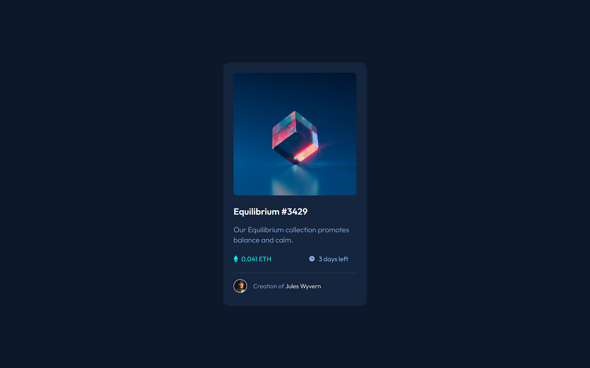
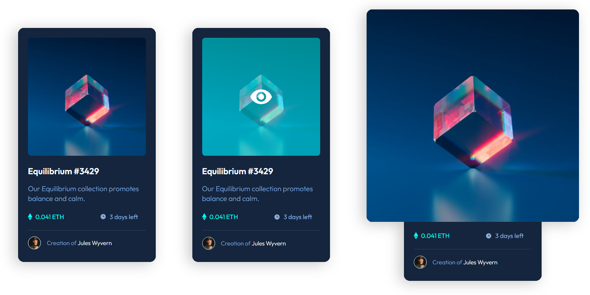

# Frontend Mentor - NFT preview card component solution

This is a solution to the [NFT preview card component challenge on Frontend Mentor](https://www.frontendmentor.io/challenges/nft-preview-card-component-SbdUL_w0U). Frontend Mentor challenges help you improve your coding skills by building realistic projects.

## Table of contents

- [Overview](#overview)
  - [The challenge](#the-challenge)
  - [Screenshot](#screenshot)
  - [Links](#links)
- [My process](#my-process)
  - [Built with](#built-with)
  - [What I learned](#what-i-learned)
  - [Useful resources](#useful-resources)
- [Author](#author)

## Overview

### The challenge

Users should be able to:

- View the optimal layout depending on their device's screen size
- See hover states for interactive elements

### Screenshot

### Links

- Solution URL: [Add solution URL here](https://your-solution-url.com)
- Live Site URL: [Add live site URL here](https://your-live-site-url.com)

## My process

### Built with

- HTML
- CSS

### What I learned

This time I tried using CSS variables for color, which makes it really easy to change the color later if needed.

Also had to study how to make the eye overlay on hover effect, since the images needed to be overlapping it was a bit challenging to do at first. I went a step further and tried to make the image expand on click, but since it needed JS and I wanted to stick with just HTML and CSS, I ended up using `active`. It was not ideal since you have to maintain left mouse click pressed, but it did the trick.

### Useful resources

- [dev.mozilla - Using CSS custom properties (variables)](https://developer.mozilla.org/en-US/docs/Web/CSS/Using_CSS_custom_properties) - Good article explaining CSS variables.
- [W3Schools - How TO - Image Overlay Icon](https://www.example.com) - This article helped me figure out how to do the icon overlay on hover.

## Author

- 🌐 Website - [phislipe.dev](https://phislipe.dev)
- 🪪 LinkedIn - [Philipe Rocha](https://www.linkedin.com/in/phislipe/)
- 🎨 Frontend Mentor - [@phislipe](https://www.frontendmentor.io/profile/yourusername)
